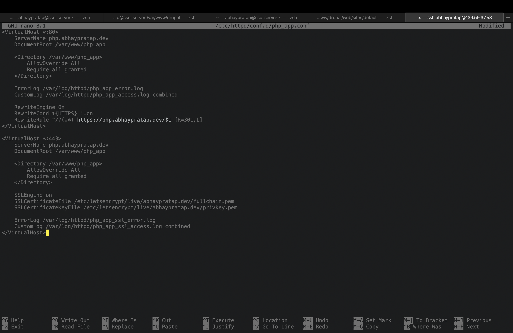
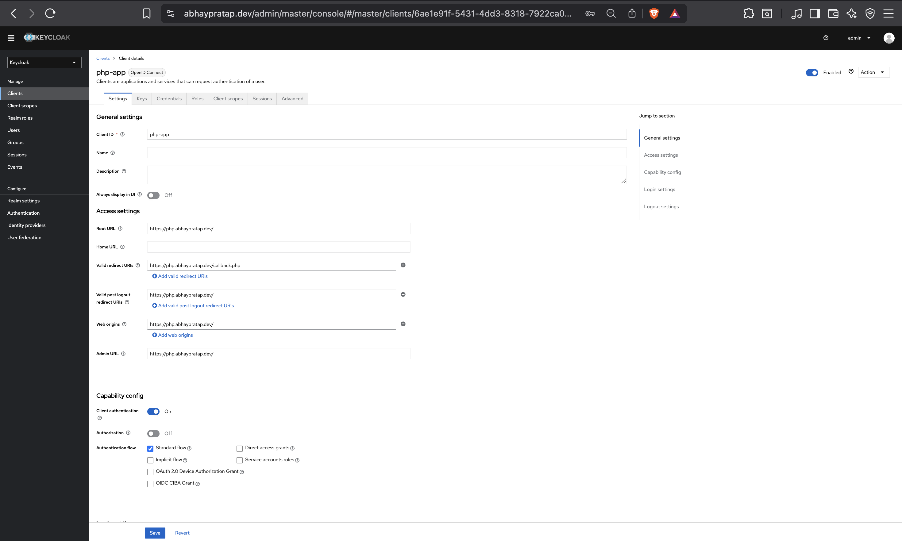
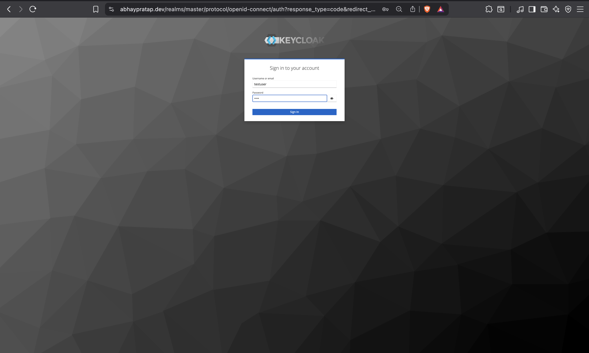
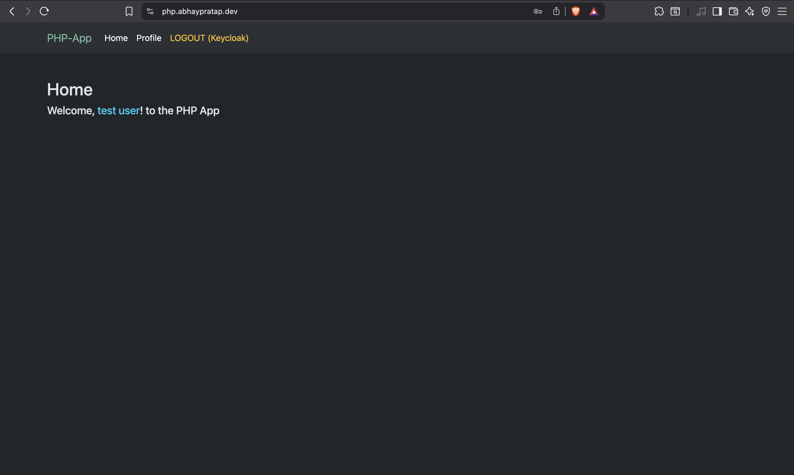
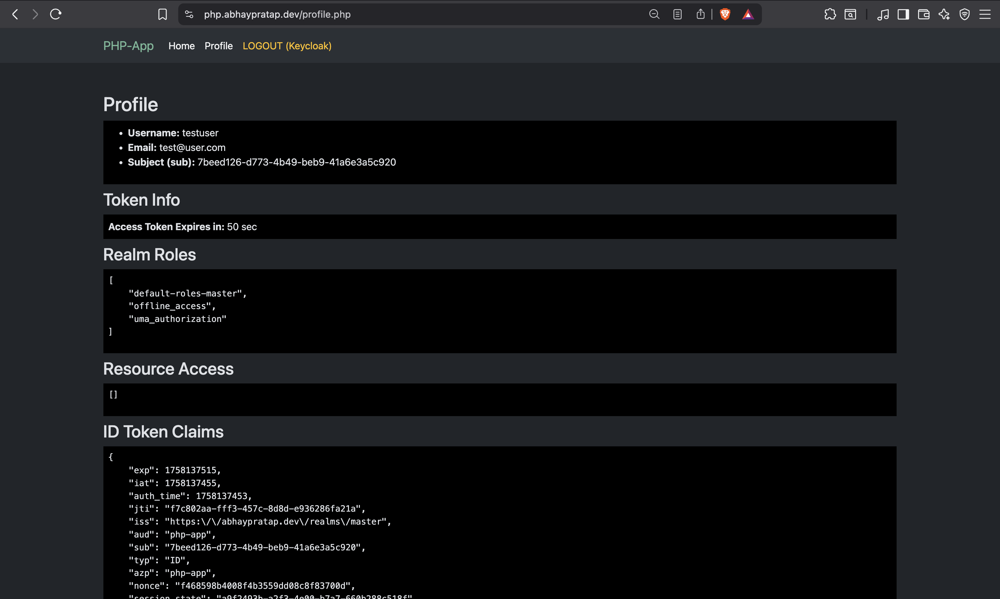

# Step 5: PHP Application Setup & Keycloak SSO Integration

This document covers deploying a PHP application with Keycloak on Rocky Linux 10, using Apache with SSL

---

## 1. Prerequisites

- Rocky Linux 10 server
- Apache with SSL enabled
- PHP 8.x installed with composer
- Domain configured: php.abhaypratap.dev
- Keycloak already running at https://abhaypratap.dev

---

## 2. Deploy PHP Application

```bash
# Create directory
sudo mkdir /var/www/php_app
sudo chown -R apache:apache /var/www/php_app
sudo chmod -R 755 /var/www/php_app

# Move into php app directory
cd /var/www/php_app

# Install OIDC client library
sudo composer require jumbojett/openid-connect-php
```

---

## 3. Configure Apache Virtual Host

Create /etc/httpd/conf.d/php_app.conf

```apache
<VirtualHost *:80>
    ServerName php.abhaypratap.dev
    DocumentRoot /var/www/php_app

    <Directory /var/www/php_app>
        AllowOverride All
        Require all granted
    </Directory>

    ErrorLog /var/log/httpd/php_app_error.log
    CustomLog /var/log/httpd/php_app_access.log combined

    RewriteEngine On
    RewriteCond %{HTTPS} !=on
    RewriteRule ^/?(.*) https://php.abhaypratap.dev/$1 [R=301,L]
</VirtualHost>

<VirtualHost *:443>
    ServerName php.abhaypratap.dev
    DocumentRoot /var/www/php_app

    <Directory /var/www/php_app>
        AllowOverride All
        Require all granted
    </Directory>

    SSLEngine on
    SSLCertificateFile /etc/letsencrypt/live/abhaypratap.dev/fullchain.pem
    SSLCertificateKeyFile /etc/letsencrypt/live/abhaypratap.dev/privkey.pem

    ErrorLog /var/log/httpd/php_app_ssl_error.log
    CustomLog /var/log/httpd/php_app_ssl_access.log combined
</VirtualHost>
```

Restart Apache:

```bash
sudo systemctl restart httpd
```



---

## 4. Configure Keycloak

- In Keycloak Admin Console:
  - Client ID: php-app
  - Root URL: `https://php.abhaypratap.dev/`
  - Redirect URIs: `https://php.abhaypratap.dev/callback.php`
  - Valid post logout redirect URIs: `https://php.abhaypratap.dev/`
  - Web Origins: `https://php.abhaypratap.dev/`
  - Front-channel logout URL: `https://php.abhaypratap.dev/logout.php`
  - Copy Client Secret



---

## 5. Application Files

Create the following files in `/var/www/php_app`:

- `config.php`
- `login.php`
- `callback.php`
- `logout.php`
- `auth.php`
- `template.php`
- `index.php`
- `profile.php`

### Source Code

The full code for each file is stored in the repository under:
[`05-php_app/`](05-php_app/)

You can browse individual files here:

- [config.php](05-php_app/config.php)
- [login.php](05-php_app/login.php)
- [callback.php](05-php_app/callback.php)
- [logout.php](05-php_app/logout.php)
- [auth.php](05-php_app/auth.php)
- [template.php](05-php_app/template.php)
- [index.php](05-php_app/index.php)
- [profile.php](05-php_app/profile.php)

---

## 6. Testing SSO

- Visit `https://php.abhaypratap.dev`
- Click "Login with keycloak" -> it redirects to Keycloak login page
- Enter credentials
- Redirected back to app
- Homepage shows username and welcome message
- Profile shows user info, token info and claims
- Click Logout -> logs out from Keycloak and clears session







